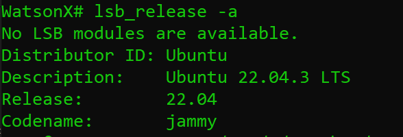

# How to Use InstructLab with Watsonx.ai


Hello everyone, today we are going to install InstructLab in Windows and we are going to explain how to use InstructLab to create a new medical chatbot.


## Introduction

In the rapidly evolving field of artificial intelligence, the need for efficient and effective methods to fine-tune large language models (LLMs) is ever-present. 

InstructLab provides a model-agnostic, open-source platform that facilitates contributions to LLMs through community-driven efforts. This approach enables the creation of robust models tailored to specific knowledge domains using synthetic-data-based alignment tuning.

In this tutorial, we will guide you through the process of setting up InstructLab on a Linux environment using Windows Subsystem for Linux (WSL) on Ubuntu 22.04. 

Following the installation, we will demonstrate how to fine-tune an LLM to create a medical chatbot, leveraging the dataset and methods we discussed earlier. By the end of this guide, you will have a comprehensive understanding of how to utilize InstructLab for your AI projects.

## Prerequisites

- **Windows 10 or 11** with WSL installed
- **Ubuntu 22.04** setup in WSL
- Basic understanding of Linux commands and Python
- 
## Step-by-Step Installation of InstructLab on Ubuntu 22.04 (WSL)

### Step 1: Set Up WSL and Install Ubuntu 22.04

1. **Enable WSL**:
    ```powershell
    wsl --install
    ```

2. **Install Ubuntu 22.04**:
    - Open the Microsoft Store, search for "Ubuntu 22.04", and click "Install".

3. **Launch Ubuntu**:
in the terminal type
```
wsl
```

once you are there you can type the following command to know the version of ubuntu you have
```
lsb_release -a

```



### Step 2: Install Necessary Dependencies

1. **Update Package List**:
    ```bash
    sudo apt update
    ```

2. **Install Python and Pip**:

   ```bash
    sudo apt install python3.11 python3.11-dev   python3-pip python3.11-venv -y
   ```
After installing Python 3.11, you need to update the default Python version on your Ubuntu system. Here's how to do it:

**Method 1: Update the default Python version using `update-alternatives`**
```
sudo update-alternatives --install /usr/bin/python python /usr/bin/python3.11 1

apt install 
```

Run the following command to verify that the default Python version has been updated:
```
python --version
```


This should output `Python 3.11`


4. **Install Other Dependencies**:
    ```bash
    sudo apt install build-essential libssl-dev libffi-dev -y
    ```

### Step 3: Install InstructLab CLI

1. **Clone the InstructLab Repository**:
    ```bash
    git clone https://github.com/instructlab/instructlab.git
    
  cd instructlab
    ```

2. **Install InstructLab CLI**:
    ```bash
    python -m venv venv
    ```

this will create a virtual environment using Python 3.11.

Once you've created the virtual environment, you can activate it using:
```
source venv/bin/activate
```
3. Check if we have CUDA 

```
nvcc -V

```
This command will display the version of the NVIDIA CUDA compiler, if it's installed.

If you see a message like "nvcc: command not found", it means that CUDA is not installed on your system.

Let us install CUDA on wsl ubuntu


```
wget https://developer.download.nvidia.com/compute/cuda/repos/wsl-ubuntu/x86_64/cuda-wsl-ubuntu.pin
```

```
sudo mv cuda-wsl-ubuntu.pin /etc/apt/preferences.d/cuda-repository-pin-600
```

```
wget https://developer.download.nvidia.com/compute/cuda/12.5.0/local_installers/cuda-repo-wsl-ubuntu-12-5-local_12.5.0-1_amd64.deb
```

```
sudo dpkg -i cuda-repo-wsl-ubuntu-12-5-local_12.5.0-1_amd64.deb
```
```
sudo cp /var/cuda-repo-wsl-ubuntu-12-5-local/cuda-*-keyring.gpg /usr/share/keyrings/
```

```
sudo apt-get update

```

```
sudo apt-get -y install cuda-toolkit-12-5
```

For more information click [here](https://developer.nvidia.com/cuda-downloads?target_os=Linux&target_arch=x86_64&Distribution=WSL-Ubuntu&target_version=2.0&target_type=deb_network)
You can add the following line to your shell configuration file (e.g., `~/.bashrc` or `~/.zshrc`):

```
export PATH=$PATH:/usr/local/cuda-12.5/bin
```
or
```bash
sudo ln -s /usr/local/cuda-12.5/bin/nvcc /usr/local/bin/nvcc
```


export PATH=/usr/local/cuda-12.5/bin${PATH:+:${PATH}}
export LD_LIBRARY_PATH=/usr/local/cuda-12.5/lib64${LD_LIBRARY_PATH:+:${LD_LIBRARY_PATH}}


Verify CUDA Installation

Verify that CUDA is installed correctly and the necessary files are in place:

```
nvcc --version

```


Check for the presence of cuda_runtime.h and cublas_v2.h:

ls /usr/local/cuda-12.5/include/cuda_runtime.h
ls /usr/local/cuda-12.5/include/cublas_v2.h


## Install with Nvidia CUDA

We go to the foldder instructlab
```
cd instructlab
```

export CMAKE_ARGS="-DLLAMA_CUDA=on -DLLAMA_NATIVE=off"
pip install instructlab


```sh
    #!/bin/bash

# Update and upgrade the system
sudo apt update && sudo apt upgrade -y

# Install required dependencies
sudo apt install python3 python3-pip python3-venv build-essential cmake -y

# Set up a virtual environment
python3 -m venv instructlab-env
source instructlab-env/bin/activate

# Upgrade pip
pip install --upgrade pip

# Set environment variables for CMake arguments
export CMAKE_ARGS="-DLLAMA_CUDA=on -DLLAMA_NATIVE=off"

# Install instructlab
pip install instructlab

# Install additional dependencies if needed
# pip install -r /path/to/instructlab/requirements.txt

# Verify installation
```

From your venv environment, verify ilab is installed correctly, by running the ilab command.

ilab
Example output of the ilab command


```
(venv) $ ilab
```


Every ilab command needs to be run from within your Python virtual environment. 


3. **Initialize InstructLab**:
Initialize ilab by running the following command:

    ```bash
ilab config init
 ```


When prompted by the interface, press Enter to add a new default config.yaml file.

When prompted, clone the https://github.com/instructlab/taxonomy.git repository into the current directory by typing y. 


### Step 4: Download the Base Model

1. **Download the Default Model**:
    ```bash
    ilab download
    ```
ilab model download downloads a compact pre-trained version of the model  from HuggingFace and store it in a models directory.


2. **Optional: Download a Specific Model**:
    ```bash
    ilab download --repository <huggingface_repo> --filename <filename>.gguf
    ```

## Creating and Training a Medical Chatbot with InstructLab

### Step 1: Prepare the Dataset

1. **Load and Clean the Dataset**:
    ```python
    import pandas as pd
    import re
    from datasets import load_dataset

    dataset_ = load_dataset("ruslanmv/ai-medical-chatbot")
    train_data = dataset_["train"]
    df = pd.DataFrame(train_data)
    df = df[["Description", "Doctor"]].rename(columns={"Description": "question", "Doctor": "answer"})
    
    df['question'] = df['question'].apply(lambda x: re.sub(r'\s+', ' ', x.strip()))
    df['answer'] = df['answer'].apply(lambda x: re.sub(r'\s+', ' ', x.strip()))
    df['question'] = df['question'].str.lstrip('Q. ')
    df['answer'] = df['answer'].str.replace('-->', '')
    ```

2. **Split the Dataset**:
    ```python
    num = 1000  # Example: Number of training samples
    df_train = df.iloc[:num, :]
    df_test = df.iloc[num:num+100, :]
    df_train.to_csv('train.csv', index=False)
    df_test.to_csv('test.csv', index=False)
    ```

### Step 2: Create Required Files for Training

1. **Create `qna.yaml`**:
    ```yaml
    task_description: Train a medical chatbot
    created_by: YourGithubUsername
    domain: healthcare
    seed_examples:
    - question: What does abutment of the nerve root mean?
      answer: Hi. I have gone through your query with diligence...
    - question: What should I do to reduce my weight gained during pregnancy?
      answer: Hi. You have really done well with the hypothy...
    document:
      repo: https://github.com/YourGithubUsername/YourRepo
      commit: <commit_SHA>
      patterns:
      - *.md
    ```

2. **Create `attribution.txt`**:
    ```text
    [Link to source]
    [Link to work]
    [License of the work]
    [Creator name]
    ```

### Step 3: Generate Synthetic Data

1. **Generate Data**:
    ```bash
    ilab generate
    ```

2. **Generate Additional Samples**:
    ```bash
    ilab generate --num-instructions 200
    ```

### Step 4: Train the Model

1. **Train the Model**:
    ```bash
    ilab train
    ```

2. **Optional: Train on GPU**:
    ```bash
    ilab train --device 'cuda'
    ```

### Step 5: Test the Model

1. **Test the Model**:
    ```bash
    ilab test
    ```

2. **Optional: Convert Model for MacOS**:
    ```bash
    ilab convert
    ```

### Step 6: Serve and Chat with the Model

1. **Serve the Model**:
    ```bash
    ilab serve --model-path instructlab-granite-7b-lab-trained/instructlab-granite-7b-lab-Q4_K_M.gguf
    ```

2. **Chat with the Model**:
    ```bash
    ilab chat -gm -m instructlab-granite-7b-lab-trained/instructlab-granite-7b-lab-Q4_K_M.gguf
    ```

### Summary

In this comprehensive guide, we have walked through the steps to set up InstructLab on a WSL Ubuntu 22.04 environment, prepare a dataset, and fine-tune a large language model to create a medical chatbot. This tutorial showcased the installation process, dataset preparation, synthetic data generation, model training, and testing, culminating in deploying and interacting with the chatbot.

By following this guide, you can leverage InstructLab to develop customized AI solutions for various domains. Join the InstructLab community on GitHub and start contributing to the open-source LLM landscape.